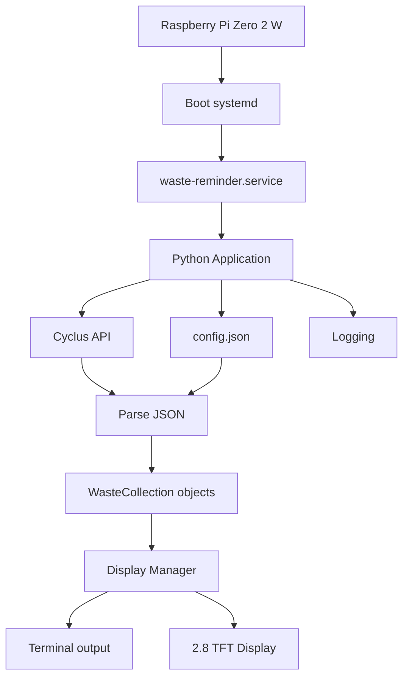

```mermaid
flowchart TD

    A[Raspberry Pi Zero 2 W]
    --> B[Boot systemd]
    --> C[waste-reminder.service]
    --> D[Python Application]

    D --> E[config.json]
    D --> F[Cyclus API]
    D --> G[Logging]

    F --> H[Parse JSON]

    E --> H

    H --> I[WasteCollection objects]

    I --> J[Display Manager]

    J --> K[Terminal output]
    J --> L[2.8 TFT Display]
```